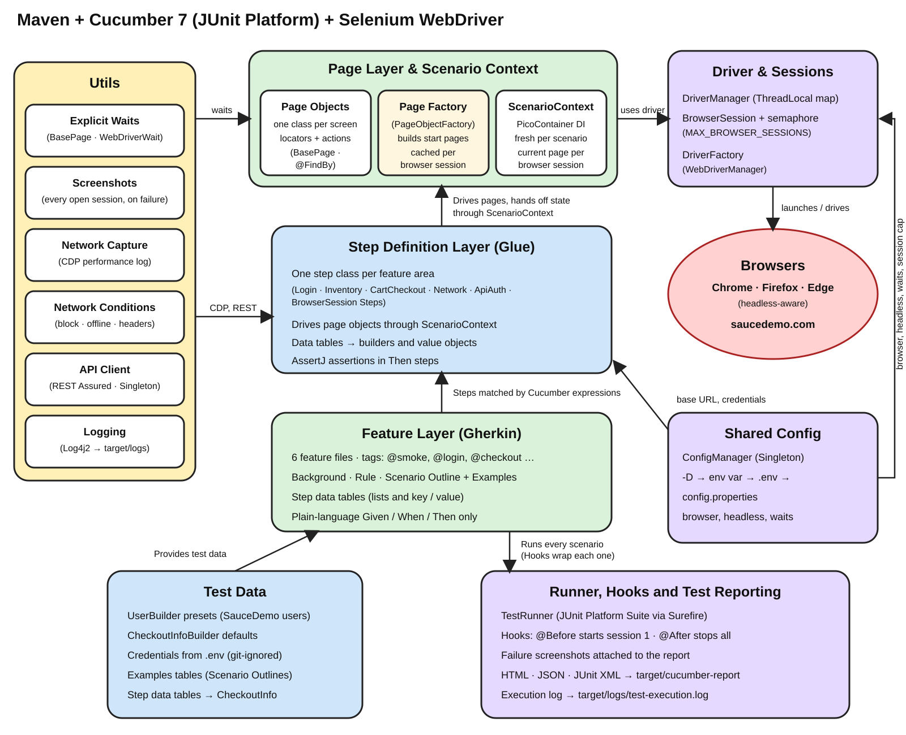

# SeleniumCucumberFramework

A Java + Selenium 4 + Cucumber 7 test automation framework built against
[SauceDemo](https://www.saucedemo.com/), a purpose-built demo e-commerce
site. It demonstrates the Page Object pattern, the Factory pattern, the
Builder pattern, multi-browser execution, browser network capture and
manipulation via the Chrome DevTools Protocol, and a REST API auth check.

<p align="center">
  
</p>

## Stack

| Concern              | Tool                                              |
|-----------------------|---------------------------------------------------|
| Browser automation     | Selenium 4 (`selenium-java`)                       |
| Driver binaries        | WebDriverManager (auto-downloads chromedriver/geckodriver/msedgedriver) |
| BDD / test structure   | Cucumber 7 (`cucumber-java`) on the JUnit Platform engine |
| Test runner            | JUnit Platform Suite (`junit-platform-suite`) via Maven Surefire |
| Config / secrets       | `dotenv-java` (`.env`) + system properties + `config.properties` |
| API testing            | REST Assured                                       |
| Assertions              | AssertJ                                            |
| Logging                | Log4j2                                             |
| Build                  | Maven                                               |

## Prerequisites

- JDK 17+
- Maven 3.9+
- Google Chrome installed (default browser). Firefox/Edge only needed if you
  run with `-Dbrowser=firefox` / `-Dbrowser=edge`.

## Setup

```bash
cp .env.example .env
# edit .env if you want different values - the defaults match the task brief
```

`.env` is git-ignored. `ConfigManager` resolves configuration in this order
(highest priority first): JVM system property → OS environment variable →
`.env` → `src/test/resources/config.properties`. This means CI can simply
export environment variables and skip `.env` entirely.

Required values (see `.env.example`):

```
TEST_USER_EMAIL=test.user@example.com
TEST_USER_PASSWORD=changeme123
API_AUTH_USERNAME=api-user
API_AUTH_PASSWORD=changeme123
SAUCEDEMO_BASE_URL=https://www.saucedemo.com/
```

## Running the tests

```bash
# default: Chrome, headed
mvn test

# headless
mvn test -Dheadless=true

# choose a browser
mvn test -Dbrowser=firefox
mvn test -Dbrowser=edge
# (equivalently: mvn test -Pfirefox / -Pedge)

# filter by Cucumber tag
mvn test -Dcucumber.filter.tags="@smoke"
mvn test -Dcucumber.filter.tags="@smoke and not @network"

# run scenarios in parallel (off by default - see junit-platform.properties for why)
mvn test -Dcucumber.execution.parallel.enabled=true
```

Reports are written to `target/cucumber-report/` (HTML, JSON, JUnit XML) and
logs to `target/logs/test-execution.log`. Failed UI scenarios get a
screenshot attached to the Cucumber report automatically (see `Hooks`).

## Feature coverage

| Feature file | What it covers |
|---|---|
| `login.feature` | Standard login, locked-out user, invalid/env-configured credentials |
| `inventory.feature` | Product listing, add-to-cart, sorting |
| `cart_checkout.feature` | Full checkout happy path, missing-field validation |
| `network_capture.feature` | Capturing CDP network traffic, blocking requests, offline emulation, injecting request headers |
| `api_auth.feature` | HTTP Basic Auth against `httpbin.org` using `API_AUTH_USERNAME`/`API_AUTH_PASSWORD` |

Tags: `@smoke` (fast confidence-check subset), `@login`, `@inventory`,
`@checkout`, `@network` + `@chromium-only` (skipped as *pending* on Firefox -
CDP isn't available there), `@api`.

## Project layout

```
src/main/java/com/scf/
  config/     ConfigManager            - env/.env/system-property resolution (Singleton)
  driver/     BrowserType, DriverFactory, DriverManager   - multi-browser driver creation (Factory) + thread-safe storage
  network/    NetworkCapture, NetworkConditions           - CDP-based traffic capture & manipulation
  pages/      BasePage + one class per SauceDemo screen   - Page Object Pattern
  factory/    PageObjectFactory                           - Factory Pattern for page objects
  builder/    UserBuilder, CheckoutInfoBuilder             - Builder Pattern for test data
  models/     User, CheckoutInfo                           - immutable value objects
  api/        ApiClient                                    - REST Assured wrapper (Singleton)
  utils/      ScreenshotUtil

src/test/java/com/scf/
  context/    ScenarioContext          - per-scenario dependency-injected "world" object
  hooks/      Hooks                    - @Before/@After: driver lifecycle, screenshot-on-failure
  stepdefinitions/                     - Given/When/Then glue, one class per feature area
  runners/    TestRunner               - JUnit Platform Suite entry point

src/test/resources/
  features/                            - .feature files (Gherkin)
  config.properties, cucumber.properties, junit-platform.properties
```

## Design patterns used (short version)

- **Page Object Pattern** (`pages/`): one class per screen; step definitions
  never touch a `By` locator directly.
- **Factory Pattern** (`driver/DriverFactory`, `factory/PageObjectFactory`):
  callers ask for "a Chrome driver" or "the LoginPage" without knowing how
  either is constructed.
- **Builder Pattern** (`builder/UserBuilder`, `builder/CheckoutInfoBuilder`):
  fluent, readable construction of test data, plus named presets for
  SauceDemo's fixed user accounts.
- **Singleton Pattern** (`config/ConfigManager`, `api/ApiClient`): one shared,
  already-configured instance instead of re-parsing config or re-wiring auth
  everywhere.
- **Dependency Injection** (Cucumber-Picocontainer + `ScenarioContext`): step
  definition classes share state without static fields, which is what makes
  the framework safe to run in parallel.

Full write-up with the *why* behind each choice: [`LEARNING_CONCEPTS.md`](LEARNING_CONCEPTS.md).

## Notes on the network tests

`network_capture.feature` uses the Chrome DevTools Protocol, which only
Chromium-based browsers (Chrome, Edge) expose through Selenium's
`HasCdp.executeCdpCommand`. On Firefox, `NetworkSteps` detects this and
raises a `PendingException`, which Cucumber reports as **pending** rather
than failing the build - run `mvn test -Dbrowser=firefox` to see this in
action.

Traffic capture reads Chrome's `performance` log (`goog:loggingPrefs`)
rather than the versioned `org.openqa.selenium.devtools.vNNN` packages, so
it keeps working across Chrome auto-updates without a matching Selenium
dependency bump - see the Javadoc on `NetworkCapture` for the full reasoning.
